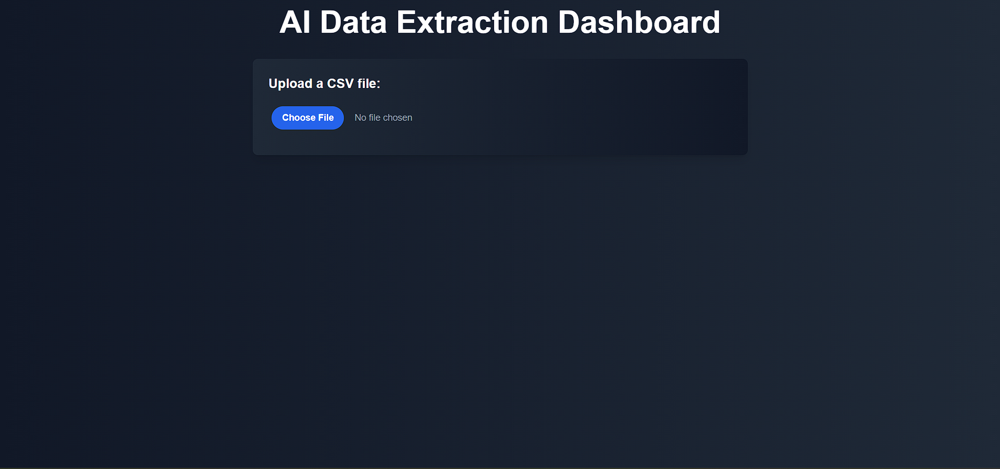
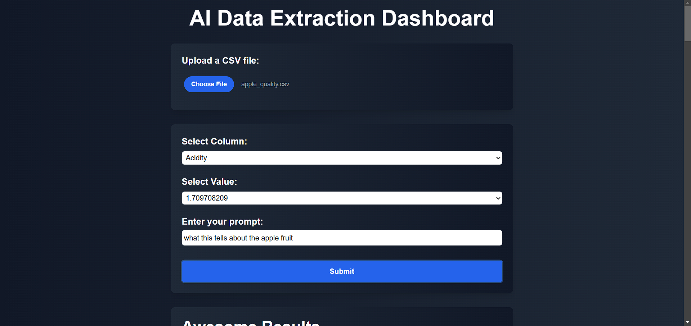
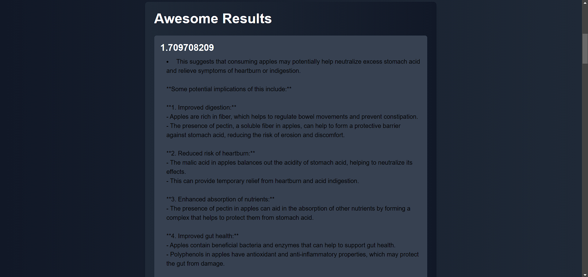

# Data Extraction and Processing Application





## Overview

This project is a comprehensive data extraction and processing application that allows users to upload data files, perform searches using SerpAPI, and extract information using Groq-based processing. The application consists of a React frontend for user interaction and a Node.js backend for handling file processing, API interactions, and data extraction.

---

## Features

### 1. File Upload and Processing
- Users can upload files (e.g., CSV files) through the frontend interface.
- Uploaded files are processed to extract columns and provide a preview of data.

### 2. Column and Value Selection with Prompt
- After uploading, users can select a specific column and value for focused data queries.
- Users can provide custom prompts to tailor the data extraction process.

### 3. SerpAPI Integration
- The application performs web searches using SerpAPI to enrich data.
- It supports retries using exponential backoff for handling network issues.

### 4. Groq-based Data Extraction
- Extracts information using a Groq-based language model (e.g., `gemma-7b-it`).
- Results are filtered to ensure only meaningful data is returned.

### 5. React Frontend
- A React-based frontend provides a clean user interface for file uploads, data preview, prompt input, and results display.
- Organized output with sections, headings, and bullet points for readability.

---

## Prerequisites
- **Node.js** (version >= 14)
- **npm** or **yarn**

---

## Installation

### 1. Clone the Repository

```bash
git clone git@github.com:Dakshya52/AI_Data_Extraction.git
